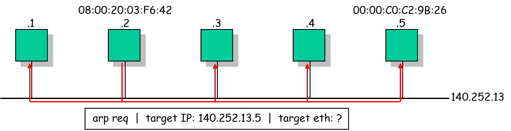
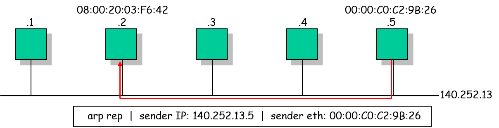
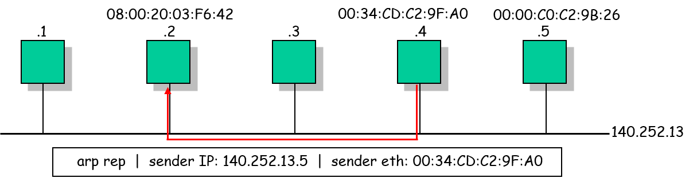

# **Kriptografija i mrežna sigurnost - Lab 1**

## Man-in-the-middle attacks (ARP spoofing)

U okviru vježbe upoznajemo se s osnovnim sigurnosnim prijetnjama i ranjivostima u računalnim mrežama. Analizirat ćemo ranjivost _Address Resolution Protocol_-a (_ARP_) koja napadaču omogućava izvođenje _man in the middle_ i _denial of service_ napada na računala koja dijele zajedničku lokalnu mrežu (_LAN_).

### ARP spoofing

<p align="center">

<br>
<em>ARP Request</em>
</p>
<br>
<p align="center">

<br>
<em>ARP Reply</em>
</p>
<br>
<p align="center">

<br>
<em>ARP Spoofing</em>
</p>

### Zadatak

Realizirati _man in the middle_ napad iskorištavanjem ranjivosti ARP protokola. Student će testirati napad u virtualiziranoj [Docker](https://docs.docker.com/get-started/overview/) mreži ([Docker container networking](https://docs.docker.com/network/)) koju čine 3 virtualizirana Docker računala (eng. _container_): dvije _žrtve_ `station-1` i `station-2` te napadač `evil-station`.

U nastavku su upute za pokretanje navedene mreže na lokalnom računalu.

1. Pokrenite Windows terminal aplikaciju i u istoj otvorite Ubuntu terminal na WSL (_Windows Subsystem for Linux_) sustavu.

2. Pozicionirajte se u odgovarajući direktorij prema uputama profesora.

3. U navedenom direktoriju klonirajte ovaj GitHub repozitorij:

   ```console
    git clone https://github.com/mcagalj/CNS-2020-21.git
   ```

4. Uđite u direktorij `arp-spoofing/`:

    ```console
    cd CNS-2019-20/arp-spoofing/
    ```

    U direktoriju se nalaze skripte `start.sh` i `stop.sh` koje možete pozvati za pokretanje/zaustavljanje virtualiziranog mrežnog scenarija. Ovdje se također nalaze `docker` i `docker-compose` konfiguracijske datoteke kojima su opisana Docker virtualna računala i odgovarajuća virtualna mreža.

    Za uvid u sadržaj navedenih skripti i konfiguracijskih datoteka možete izvršiti sljedeću naredbu u direktoriju `arp-spoofing/`:

    ```console
    code .
    ```

    Na ovaj način otvarate editor _Visual Studio Code_ unutar kojeg možete vidjeti detalje skripti i datoteka.

5. Daljnje korake i upute student će dobiti u realnom vremenu na samim labovima.
