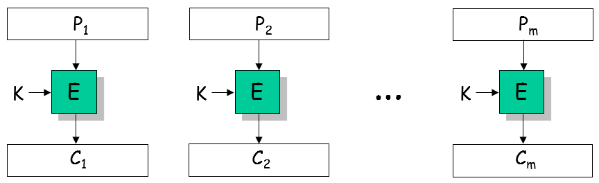

# **Kriptografija i mrežna sigurnost - Lab 3**

## ECB mode vulnerabilities

_Electronic Code Book_ (ECB) način je enkripcije poruka primjenom blok šifri kao što su DES/3DES i AES. Budući da blok šifre rade s blokovima fiksne duljine (npr. AES koristi 128-bitne blokove), poruke koje su dulje od nominalne duljine bloka dane šifre enkriptiramo na način da poruku razbijemo na više blokova prije enkripcije. U ECB modu, svaki blok se zatim enkriptira/dekriptira odvojeno i neovisno od drugih blokova (vidi sliku u nastavku).

Neka je P _plaintext_ poruka duga _m_ blokova, P = P<sub>1</sub>, P<sub>2</sub>, ... , P<sub>m</sub>. U ECB modu odgovarajući _ciphertext_ dobije se kako slijedi (vidi priloženu sliku): C = C<sub>1</sub>, C<sub>2</sub>, ... , C<sub>m</sub>, uz C<sub>i</sub> = E<sub>K</sub>(P<sub>i</sub>), za i = 1...m.

<br/>
<p align="center">

<br><br>
<em>Enkripcija u ECB modu</em>
</p>
<br/>

U vježbi ćemo pokazati da ECB mod generalno ne osigurava povjerljivost poruke unatoč tome što koristimo siguran enkripcijski algoritam AES.

Zadatak studenta u okviru vježbe je dekriptirati tekst enkriptiran AES šifrom u CBC enkripcijskom modu. Ključ koji je potreban za dekripciju student treba otkriti u interakciji s odgovarajućim virtualnim serverom (kojeg kolokvijalno zovemo _crypto oracle_).

Šifrirani tekst student može dohvatiti konzumiranjem REST API-ja koji je dokumentiran i dostupan na studentovom virtualnom web serveru.

### Opis REST API-ja

U ovoj vježbi student će slati sljedeće HTTP zahtjeve svom _crypto oracle_-u:

```Bash
POST /ecb HTTP/1.1
plaintext = 'moj plaintext'
```

Za potrebe testiranja, ovaj REST zahtjev možete jednostavno poslati kroz sučelje Crypto Oracle API.

_Crypto oracle_ (vaš REST server) uzima vaš _plaintext_, spaja ga s tajnim _cookie_-jem, enkriptira rezultat (tj. `plaintext + cookie`) primjenom AES šifre u ECB modu tajnim 256 bitnim ključem (`aes-256-ecb`) i vraća vam odgovarajući _ciphertext_.

```Bash
{"ciphertext":"65a192c1cdf3a75c344c3535b3fccb2366c636e07094726194bc7375a09ca672"}
```

<br/>
<p align="center">

<br><br>
<em>ECB mod u crypto oracle-u</em>
</p>
<br/>

NAPOMENA: Striktno govoreći, server će enkriptirati `plaintext + cookie + padding`; `aes-256-ecb` automatski dodaje _padding_, no ovaj detalj nije toliko relevantan za rješavanje zadatka.

### Kratki savjeti i korisne informacije

1. Ranjivost ECB enkripcijskog moda proizlazi iz činjnice da jednostavno možete uočiti jesu li dva _plaintext_ bloka identična tako da uspoređujete odgovarajuće _ciphertext_ blokove. Budući da se radi o determinističkoj enkripciji, isti _plaintext_ blok rezultirat će istim _ciphertext_ blokom; ako se koristi isti enkripcijski ključ (naš slučaj).

2. Iskoristite prethodnu činjnicu i pokušajte ECB _crypto oracle_-u slati različite _plaintext_ poruke. Razmislite kako bi trebali varirati testne _plaintext_ poruke da bi vam ECB _oracle_ dao potencijalno korisnu informaciju.

3. Tajni _cookie_ dug je 16 byte.

4. Koristite primitivna sredstva poput olovke i papira te pokušajte sebi skicirati ovaj problem.