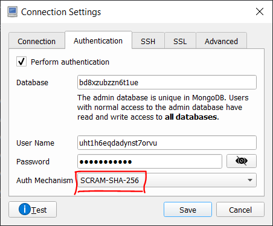

# **Kriptografija i mrežna sigurnost - Lab 8**

## Certificate Authorities (CAs) and TLS protocol

U okviru vježbe student će implementirati kontrolu pristupa za jednostavnu web aplikaciju primjenom TLS protokola. Cilj vježbe je ostvariti siguran kanal između klijentske aplikacije i odgovarajućeg web servera. Student će realizirati autentikaciju korisnika putem zaporki i klijentskih certifikata. Autentikacija servera također će se realizirati na osnovu certifikata.

Autentikacija zasnovana na digitalnim certifikatima zahtjeva generiranje i održavanje više tipova certifikata (u formatu x509v3): _**root certificate authority (CA)**_ certifikat (_**Cert CA**_), certifikat za web server (_**Cert S**_), te klijentski certifikat (_**Cert C**_). CA certifikat može bit samo-potpisan (_self-signed_), dok serverski i klijentski certifikat potpisuje (izdaje) CA, kako je prikazano na slici u nastavku.

<p align="center">

<br>
<em>Certificate hierarchy</em>
</p>

Za potrebe pokretanja vlastitog _certificate authority (CA)_ entiteta student može koristiti izvrstan alat za upravljanje asimetričnim ključevima i certifikatima [XCA](http://xca.hohnstaedt.de/xca). Alternativno, možete koristiti OpenSSL - [OpenSSL Certificate Authority](https://jamielinux.com/docs/openssl-certificate-authority).

### Uputstva za instalaciju i pokretanje web aplikacije

Web aplikacija za potrebe ove vježbe pisana je u popularnom Node.js okviru za razvoj web aplikacija - [Express.js](https://expressjs.com). Također je korištena popularna NoSQL (_document based_) baza - [MongoDB](https://www.mongodb.com/what-is-mongodb). U okviru web aplikacije MongoDB koristi se za pohranu korisničkih računa (korisnička imena, zaporke) na osnovu kojih se možemo prijavljivati u web aplikaciju.

<p align="center">

<br>
<em>Setup za vježbu</em>
</p>

**NAPOMEA:** Za potrebe ove vježbe, web aplikacija, web server i TLS/https server implementirani su u Node.js-u. U produkciji, web server i TLS/https server obično se konfiguriraju na tzv. _reverse proxy_ serverima (Nginx, Apache, IIS), dok se Node.js koristi za implementaciju aplikacijske logike.

#### Instalacija i konfiguracija MongoDB

Instancu Mongo baze ćemo kreirati putem [Clever Cloud IT Automation platforme](https://www.clever-cloud.com).

1. Prijavite se na Clever Cloud; najjednostavniji način je korištenjem GitHub računa.

2. U izborniku _Personal space_ kreirajte besplatnu verziju Mongo baze na način da istu odaberete kroz opciju _add-ons_. Nakon što je instanca baze kreirana i pokrenuta, u odgovarajućem _dashboard_-u možete vidjeti važne detalje vezane uz bazu (ime, host, port, detalje korisničkog računa za spajanje na bazu i dr.).

3. Za jednostavan pregled i manipulaciju podatka u Mongo bazi instalirajte izvrstan _MongoDB manager_ [Robo 3T](https://robomongo.org/download) (koristite **Robo 3T: the hobbyist GUI**, ne **Studio 3T**).

4. Pokrenite Robo 3T i uspostavite vezu s instancom baze pokrenutom na Clever Cloudu. Informacije potrebne za pozvezivanje s vašom instancom baze dostupne su kroz Clever Cloud _dashboard_.

    ```Bash
    MONGODB_ADDON_HOST=bd8xzubzzn6t1ue-mongodb.services.clever-cloud.com
    MONGODB_ADDON_DB=bd8xzubzzn6t1ue
    MONGODB_ADDON_USER=uht1h6eqdadynst7orvu
    MONGODB_ADDON_PORT=27017
    MONGODB_ADDON_PASSWORD=password:-)
    ```

<br>
<p align="center">

<br>
<em>Robo 3T connection settings (1/2)</em>
</p>
<br>
<p align="center">

<br>
<em>Robo 3T connection settings (2/2)</em>
</p>

#### Dodavanje računa s ograničenim ovlastima za pristup bazi

**VAŽNO:** U prethodnoj fazi povezivali ste se na bazu korištenjem privilegiranog (administratorskog) računa koji je za vas kreirao Clever Cloud. Administrator baze ima razna napredna dopuštenja kao što su dodavanje/brisanje drugih korisnika, kreiranje/brisanje (_drop_) baza, dodavanje/brisanje _collectiona_ (ekvivalent tablica kod SQL baza).

Kao što je vidljivo na slici na kojoj je prikazana arhitektura sustava, web aplikacija (server) spaja se na bazu. Budući da su sve aplikacije podložne _bugovima_ a da je ista direktno izložena klijentu (potencijalno napadaču), dobra mjera predostrožnosti je dati aplikaciji minimum dopuštenja koji joj je potreban za izvršavanje potrebnih zadaća. U našem slučaju, web aplikacija treba prava na bazu koja joj omogućavaju isključivo _read/write_ operacije (ne treba imati ovlasti za npr. kreiranje nove baze, brisanje postojeće, brisanje ili dodavanje _collection_ i sl.).

U tom smislu u ovoj fazi ćemo kreirati korisnički račun za web aplikaciju koji će imati ograničena dopuštenja (_read/write_).

1. U Robo 3T manageru otvorite tzv. `mongo shell` (desni klik na ime baze i klik na Open Shell).

2. Kreirajte novog korisnika (npr., `lab7`) s `read/write` pravima na vašoj bazi unošenjem sljedeće naredbe u `mongo shell` i pristiskom na F5 ili Ctrl + Enter (_prethodno prilagodite polja `user`, `pwd` i `db` prema vašim postavkama_):

    ```Bash
    db.createUser({
        user: "lab7",
        pwd: "this is my super secret password",
        roles: [
            { role: "readWrite", db: "bd8xzubzzn6t1ue" }
        ]
    })
    ```

    Za pregled svih računa na ovoj bazi u novom `mongo shell`-u izvršite naredbu `show users`.

#### Popunjavanje MongoDB korisničkim računima

U ovoj fazi vježbe vaš zadatak je popuniti kreiranu bazu podataka korisnicima koji će imati prava prijaviti se i koristiti web aplikaciju; _**naglašavamo, ovi korsnici se logiraju u web aplikaciju a ne na bazu podataka**_.

Za tu svrhu pripremljena je jednostavna NodeJS skripta koju trebate pokrenuti iz komandnog prozora. Skripta će automatski popuniti bazu s listom predefiniranih korisnika. Prethodno pokretanju navedene skripte možete po želji proširiti listu korisnika svojim korisničkim računom.

1. _Pullajte_/klonirajte/preuzmite `express-web-app` iz GitHub repozitorija.

2. U terminalu se pozicionirajte u direktorij `express-web-app` i instalirajte potrebne module izvršavanjem naredbe:

   ```Bash
   npm install
   ```

3. U komandnom prozoru otvorite direktorij `express-web-app\utils\db`. U direktoriju se nalaze dvije skripte:
    1. `dummy.data.js` - sadrži predefinirane korisnike (korisnička imena, zaporke, info).
    2. `populate.db.js` - povezuje se na specificiranu bazu i puni je korisnicima iz prethodne skripte; ova skripta također _hashira_ zaproke korisnika prije njihova slanja i pohrane u bazu.

4. (**Opcionalno**) U editoru otvorite `dummy.data.js` i proširite popis korisnika tako da dodate sebe (svoje ime, odgovarajuće korisničko ime i zaporku, ...) kao jednog od korisnika.

5. Skripta `populate.db.js` koja puni bazu podacima treba se autenticirati na bazu. Skripta će se autenticirati s prethodno kreiranim korisničkim računom `lab7`. U tu svrhu, otvorite datoteku `.env` i popunite je s odgovarajućim korisničkim informacijama kako slijedi:

   ```Bash
    MONGODB_ADDON_DB="bd8xzubzzn6t1ue"
    MONGODB_ADDON_HOST="bd8xzubzzn6t1ue-mongodb.services.clever-cloud.com"
    MONGODB_ADDON_PASSWORD="this is my super secret password"
    MONGODB_ADDON_PORT="27017"
    MONGODB_ADDON_USER="lab7"
   ```

    Konačno, pokrenite skriptu za popunjavanje baze podacima kako slijedi:

    ```Bash
    npm run data
    # this translates to the following call:
    # node -r dotenv/config ./utils/db/populate.db.js
    ```

    U Robo 3T manageru osvježite pregled podataka i uvjerite se da su dodane 4 kolekcije (_collections_): `chartpoints`, `permissions`, `roles`, `users`, zajedno s korisničkim podacima u kolekciji `users`.

#### Pokretanje i testiranje web aplikacije

U posljednjoj fazi pokrećemo web aplikaciju/web server. Web aplikacija koristi skriptu `config.js` (u _root_-u direktoriju `express-web-app`) za podešavanje raznih konfiguracijskih opcija.

1. Pokrenite web aplikaciju tako da izvršite:

    ```Bash
    npm run dev
    ```

    Web aplikacija će se povezati na bazu podataka korištenjem računa `lab7` (sve podatke potrebne za povezivanje na bazu aplikacija čita iz `.env` datoteke).

2. Pokrenite preglednik i pokušajte se logirati u web aplikaciju s jednim od korisničkih računa iz kolekcije `users` (npr., `pperic`).

#### Aplikacije za upravljanje certifikatima - XCA

Preuzmite aplikaciju [XCA](https://hohnstaedt.de/xca) i instalirajte je na lokalnom računalu.

**VAŽNO:** Ostatak uputa potrebnih za web aplikacije za autentikaciju korisnika putem certifikata ćete dobiti na samim vježbama.
